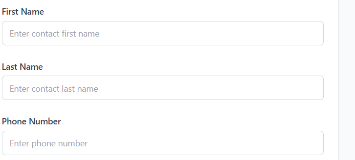
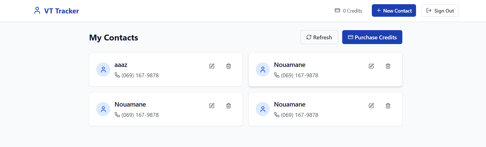
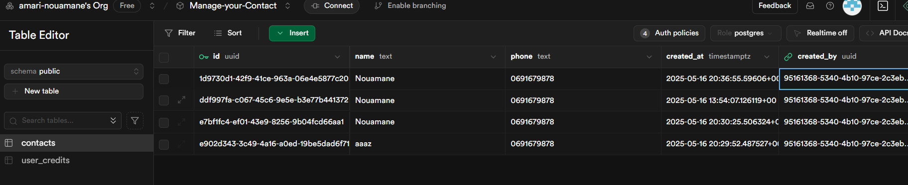
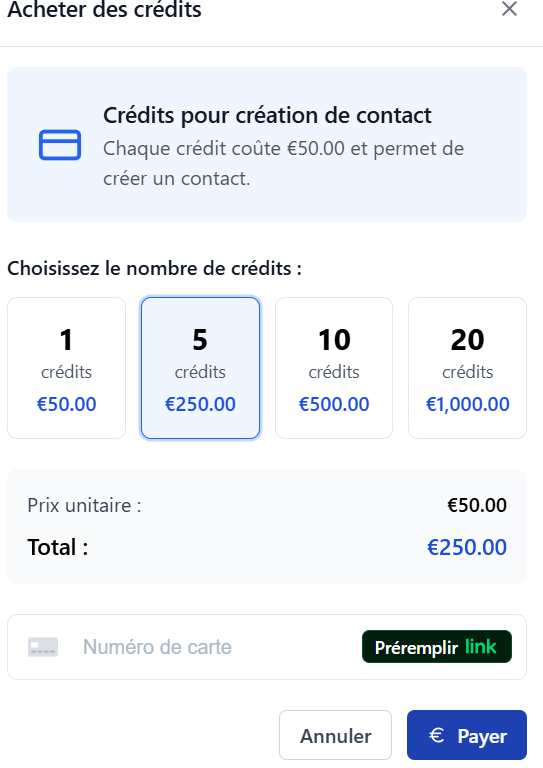
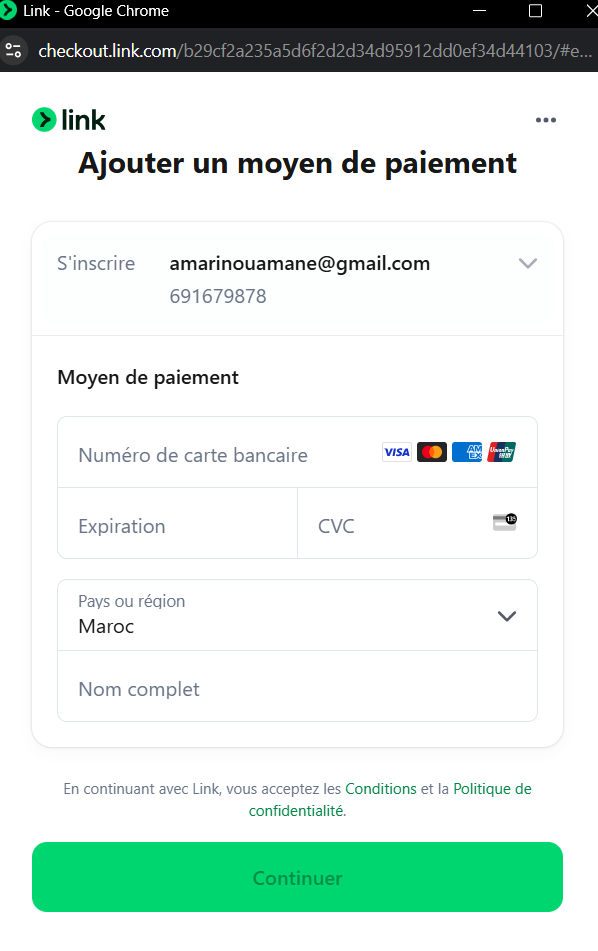
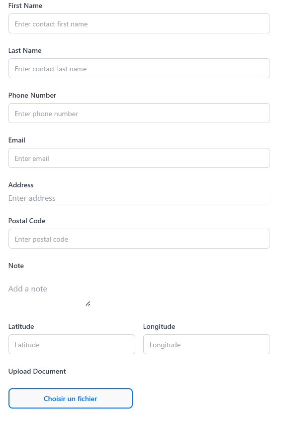

# VT Tracker - Contact Management App

A Next.js application for managing contacts with Supabase authentication and Stripe payment integration.

## Setup

1. Clone the repository
2. Install dependencies:
   ```bash
   npm install
   ```

3. Create a `.env.local` file at the root of the project with the following environment variables:
   ```
   # Supabase
   NEXT_PUBLIC_SUPABASE_URL=your-project-url
   NEXT_PUBLIC_SUPABASE_ANON_KEY=your-anon-key

   # Stripe
   NEXT_PUBLIC_STRIPE_PUBLISHABLE_KEY=pk_test_your_key
   STRIPE_SECRET_KEY=sk_test_your_key
   STRIPE_WEBHOOK_SECRET=whsec_your_webhook_secret
   ```

4. Run the development server:
   ```bash
   npm run dev
   ```

5. Open [http://localhost:3000](http://localhost:3000) in your browser.

## Environment Variables

- `NEXT_PUBLIC_SUPABASE_URL`: Your Supabase project URL
- `NEXT_PUBLIC_SUPABASE_ANON_KEY`: Your Supabase anonymous key
- `NEXT_PUBLIC_STRIPE_PUBLISHABLE_KEY`: Your Stripe publishable key (starts with pk_)
- `STRIPE_SECRET_KEY`: Your Stripe secret key (starts with sk_)
- `STRIPE_WEBHOOK_SECRET`: Your Stripe webhook signing secret (starts with whsec_)

## Payment System Implementation

The application uses Stripe for payment processing with the following components:

1. **Client-side payment form**: CreditPurchaseModal component that collects card details using Stripe Elements
2. **Payment Intent API**: Server-side API route that creates a payment intent with Stripe
3. **Webhook Handler**: Processes successful payments and adds credits to user accounts

### Setting up Stripe

1. Create a [Stripe account](https://stripe.com/en-en)
2. In your Stripe Dashboard, get your API keys (Publishable and Secret)
3. Set up a webhook endpoint: 
   - Local development: Use Stripe CLI for local testing
   - Production: Point to `https://your-domain.com/webhook`
4. Get the webhook signing secret and add it to your environment variables

### Database Schema

The application requires the following Supabase tables:

1. `user_credits`:
   - `user_id` (primary key, references auth.users.id)
   - `credits` (integer)
   - `created_at` (timestamp with timezone)
   - `updated_at` (timestamp with timezone)

2. `payments`:
   - `id` (auto-generated UUID primary key)
   - `user_id` (references auth.users.id)
   - `amount` (numeric)
   - `credits` (integer)
   - `status` (text)
   - `created_at` (timestamp with timezone)

### Row-Level Security Policies

Set up the following RLS policies in Supabase:

```sql
-- For user_credits table
CREATE POLICY "Users can read their own credits"
  ON user_credits FOR SELECT
  USING (auth.uid() = user_id);

-- For payments table
CREATE POLICY "Users can read their own payments"
  ON payments FOR SELECT
  USING (auth.uid() = user_id);
```

## Features

- User authentication (sign up, sign in, sign out)
- Contact management (create, read, update, delete)
- Credit system for adding contacts
- Stripe integration for purchasing credits

## Technologies

- Next.js App Router
- Supabase (Auth, Database, Storage)
- TypeScript
- Tailwind CSS
- Stripe Payment Processing

<div style="background-color:#f8d7da; color:#721c24; padding:12px; border-radius:6px; border:1px solid #f5c6cb; margin-bottom:16px;">
<strong>Bug corrigé :</strong> <em>"Failed to load contacts"</em>
</div>
- Créer un compte Supabase et configurer les clés d'accès dans un fichier `.env`.
- Créer la table `contacts` avec les colonnes nécessaires dans la base Supabase.
- Configurer les permissions pour autoriser l'accès aux données.
- Tester la connexion front-end / base de données pour valider le chargement des contacts.

<div style="background-color:#f8d7da; color:#721c24; padding:12px; border-radius:6px; border:1px solid #f5c6cb; margin-bottom:16px;">
<strong>Correction et amélioration des interfaces:</strong>
</div>
Dans le formulaire d'ajout de contact, séparer le champ "Name" en deux champs distincts : "First Name" et "Last Name".

Dans le header, remplacer le bouton "New Contact" par "Purchase Credits".

Lorsqu'un achat de crédits est effectué, enregistrer cette information dans la base de données.
<p style ="align=center">
  
</p>

<div style="background-color:#f8d7da; color:#721c24; padding:12px; border-radius:6px; border:1px solid #f5c6cb; margin-bottom:16px;">
<strong>Troisième mission : Ajout de fonctionnalités</strong>
</div>

<div style="background-color:#d1ecf1; color:#0c5460; padding:12px; border-radius:6px; border:1px solid #bee5eb; margin-bottom:16px;">
<strong>Intégration de Stripe :</strong> <br>
Les paiements pour l'achat de crédits doivent passer par <a href="https://stripe.com/fr" target="_blank" style="color:#0c5460; text-decoration:underline;">Stripe</a>.
</div>




<div style="background-color:#e2e3e5; color:#383d41; padding:12px; border-radius:6px; border:1px solid #d6d8db; margin-bottom:16px;">
<strong>Champs à ajouter :</strong>
<ul style="margin: 8px 0 0 20px;">
  <li><strong>E-mail</strong></li>
  <li><strong>Adresse</strong></li>
  <li><strong>Code postal</strong></li>
  <li><strong>Note</strong></li>
  <li><strong>Téléversement de documents</strong></li>
</ul>
</div>

